# GuideMate Android

GuideMate is the Android client of a full-stack tour platform that connects travelers with local guides. It provides role-specific experiences for tourists and guides, including tour discovery and publishing, reservations, payments, real-time messaging, notifications, profiles, and wallet flows.

Backend repository: [GuideMateBackend](https://github.com/Ahmetkaragunlu/GuideMateBackend)

## Key Features

### Tourist

- Tour discovery by city, category, language, and date
- Guide profiles, level badges, ratings, and reviews
- Tour checkout, reservation, cancellation, and refund tracking
- Wallet balance, top-up, and transaction history
- Ratings and reviews after completed tours

### Guide

- Four-step tour creation and publishing flow
- Tour session, date, capacity, and meeting-point management
- Tracking of tours under review, published tours, and tour history
- Reservation, earnings, bank account, and withdrawal management
- Guide levels and ratings derived from completed tours and reviews

### Shared Experience

- Email/password and Google sign-in
- Email verification, password recovery, and role selection
- JWT-authenticated real-time messaging
- Firebase Cloud Messaging notifications
- Profile and tour image uploads from camera or gallery
- User-specific notification and chat navigation

## Architecture

The application follows feature-first Clean Architecture with MVVM. Each feature owns its `data`, `domain`, `presentation`, and optional `di` responsibilities.

```text
feature/
├── data/           # APIs, local sources, DTOs, mappers, repository implementations
├── domain/         # Models, repository contracts, and business rules
├── presentation/   # Compose screens, ViewModels, and UI models
└── di/             # Hilt dependency bindings
```

Core architecture principles:

- ViewModels, Coroutines, and StateFlow drive lifecycle-aware unidirectional UI state.
- The domain layer is independent of Android UI and networking details.
- Repository contracts live in domain, while implementations live in data.
- Shared networking, errors, pagination, storage, and UI behavior are centralized under `common`.
- Navigation Compose routes are type-safe through Kotlin Serialization.

## Technical Decisions

### Secure Session Management

Access and refresh tokens are encrypted with an AES/GCM key protected by Android Keystore. When an access token expires during concurrent requests, only one refresh operation is executed and the remaining requests reuse its result. User-scoped local session and notification state is cleared when accounts change.

### Networking and Error Handling

A shared network layer is built on Retrofit and OkHttp. Stable backend error codes are mapped to feature-owned Android errors and localized user-facing messages. Pagination and filtering follow the backend API contract.

### Real-Time Communication

Messaging uses a JWT-authenticated STOMP 1.2 client implemented over OkHttp WebSocket. The app manages frame encoding and decoding, subscriptions, user queues, reconnect behavior, and the connection lifecycle.

### Notification Safety

Firebase Installation ID is linked to the authenticated user-device registration on the backend. The recipient identifier in push data is checked against the active session, preventing notifications from being displayed to the wrong user after an account switch on the same device.

### Payments

iyzico Checkout Form runs inside a restricted WebView. WebView content is never treated as proof of payment; the canonical result is verified through backend polling. Card numbers and CVV values are never stored by the Android application.

### Location and Media

Country and language options are generated dynamically from ISO codes. City search is localized through Google Places. Images selected from the camera or gallery are orientation-corrected, resized, and uploaded as multipart content.

## Tech Stack

- Kotlin, Jetpack Compose, and Material 3
- MVVM and Feature-First Clean Architecture
- Hilt and KSP
- Coroutines, Flow, and StateFlow
- Navigation Compose and Kotlin Serialization
- Retrofit, OkHttp, and Gson
- Android Keystore and DataStore
- Firebase Cloud Messaging and Installations
- Google Credential Manager and OAuth 2.0
- Google Places SDK
- Coil and ExifInterface
- JUnit, Coroutines Test, MockWebServer, Robolectric, and Compose UI Test

## Requirements

- Android Studio
- JDK 21
- Android SDK 36
- Minimum Android API 30
- A running GuideMateBackend instance
- Google Places API key
- Firebase Android configuration
- Google Web OAuth client ID

## Local Setup

1. Clone the repository:

   ```bash
   git clone https://github.com/Ahmetkaragunlu/GuideMate.git
   cd GuideMate
   ```

2. Add the local SDK and application settings to `local.properties` in the project root:

   ```properties
   sdk.dir=/absolute/path/to/Android/sdk
   PLACES_API_KEY=your-google-places-api-key
   GUIDEMATE_API_BASE_URL=http://your-backend-host:8080/
   ```

   Debug builds allow an HTTP backend on the local network. Release configuration requires HTTPS.

3. Download `google-services.json` from Firebase Console and place it at `app/google-services.json`.

4. Match `default_web_client_id` in `app/src/main/res/values/strings_auth.xml` with the Web OAuth Client ID configured by the backend.

5. Start the backend, then run the application from Android Studio.

Local configuration and Firebase credential files are excluded from Git.

## Build and Test

```bash
./gradlew assembleDebug
./gradlew testDebugUnitTest
./gradlew connectedDebugAndroidTest
```

Instrumentation tests require a running emulator or physical device.

## Screenshots

The screenshots show the Turkish localization and the main application flows with representative data.

### Onboarding and Authentication

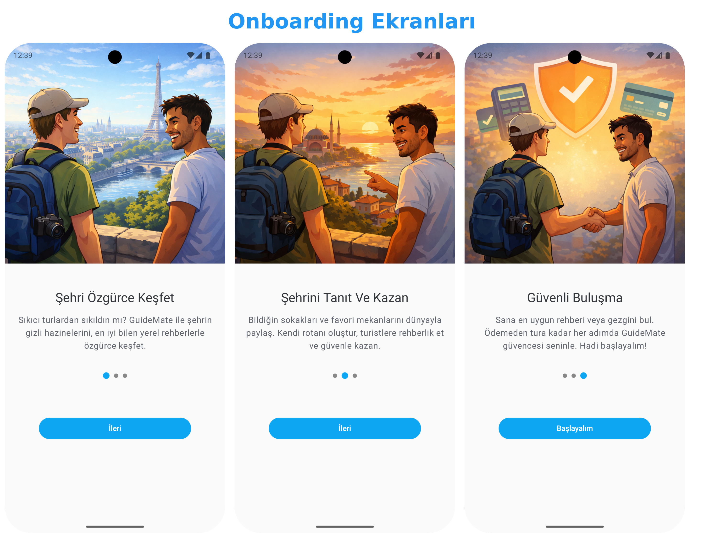

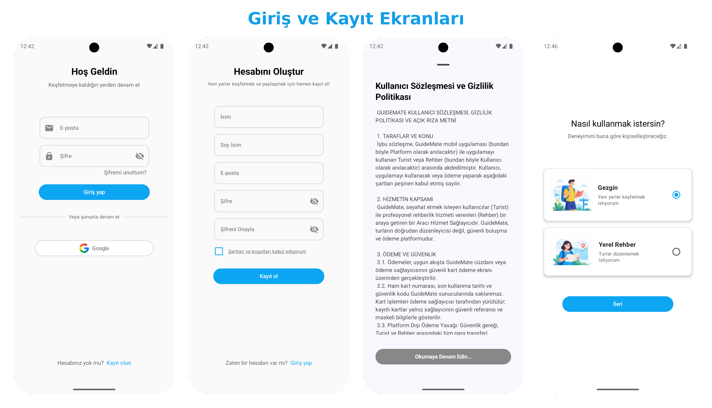

### Guide Experience

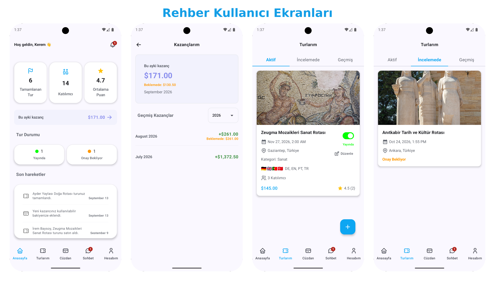

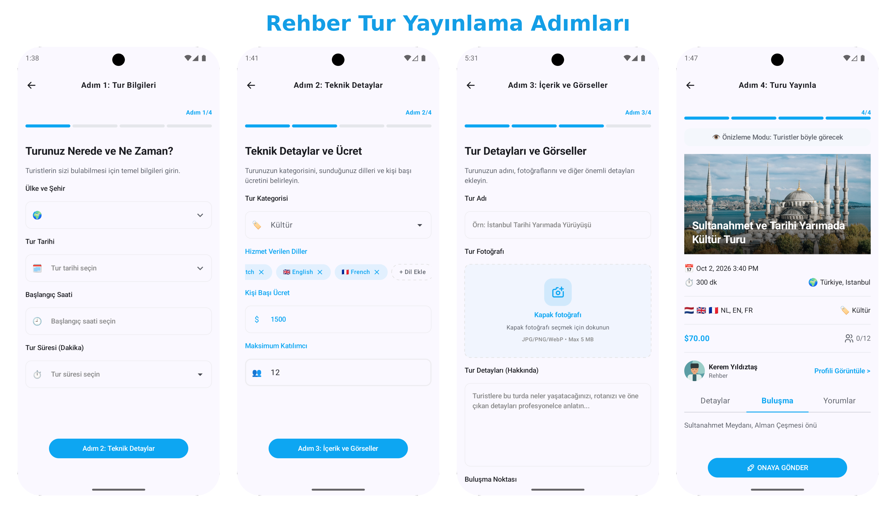

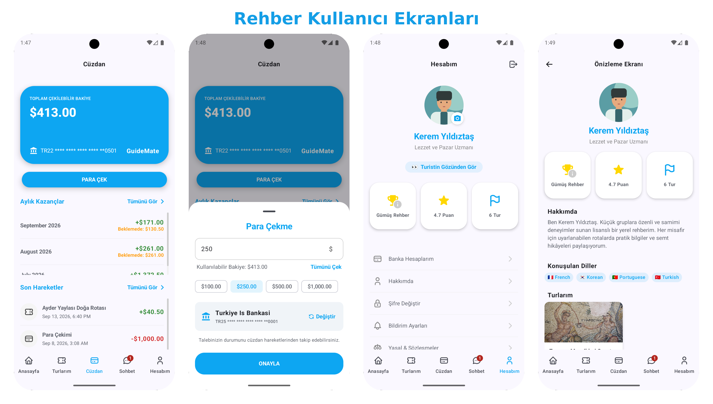

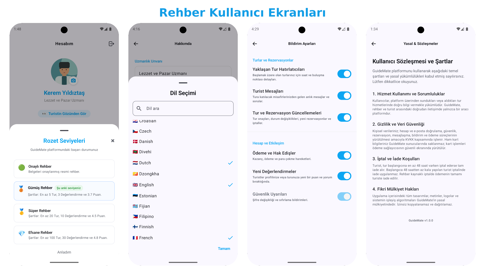

### Tourist Experience

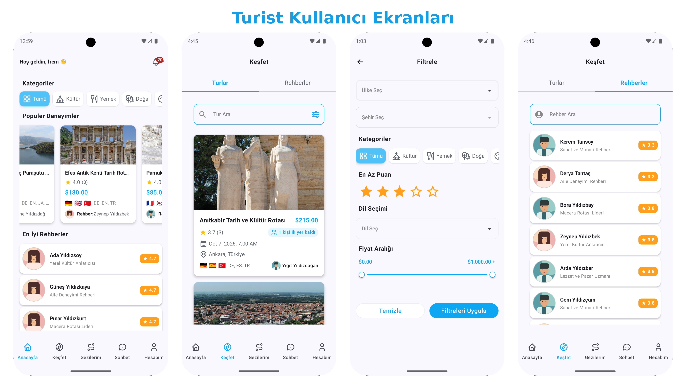

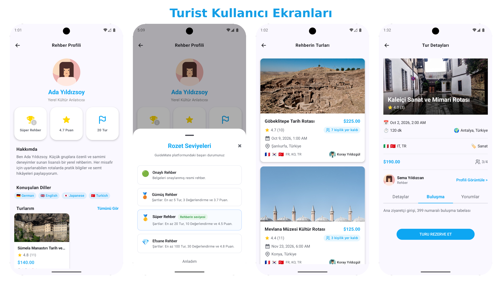

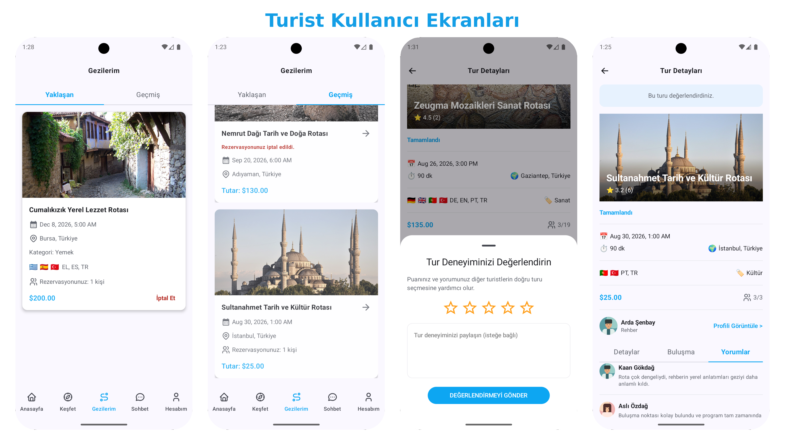

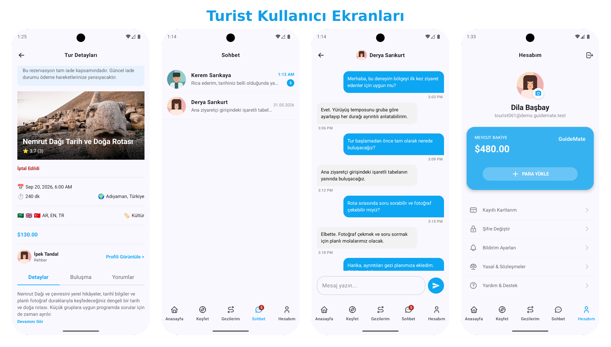

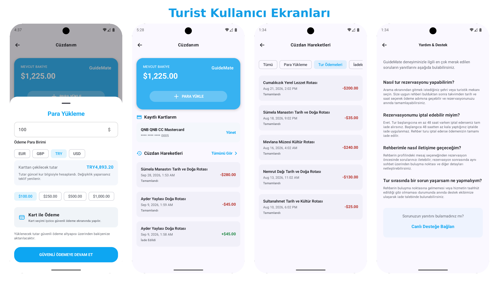

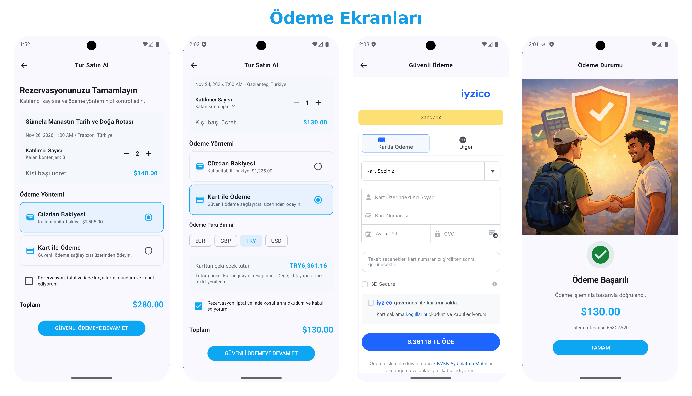

## Sandbox Status

- Tour checkout, wallet top-up, and refund flows run through iyzico Sandbox.
- Payment tests use iyzico test cards; no real money is transferred.
- Guide withdrawal requests are processed in `SIMULATED` mode by default on the backend.

## Security Note

API keys, Firebase configuration, and local backend addresses are not committed. This repository contains client code only; authoritative rules for payments, balances, capacity, reservations, and authorization are enforced by the backend.
